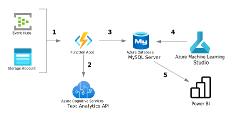

[!INCLUDE [header_file](../../../includes/sol-idea-header.md)]

Develop sophisticated, transformational apps using state of the art machine learning algorithms and integrated visualization tools to get actionable insights and analytics.

## Architecture

*Download an [SVG](../media/intelligent-apps-using-azure-database-for-postgresql.svg) of this architecture.*

The data flows through the solution as follows:

1. Data could come from various sources such as Event Hubs for high volumes of data ingestion or data uploaded to Blob Storage. An Azure Function App is triggered as new data is received.
2. The Azure Function App calls the Text Analytics API in Azure Cognitive Services to analyse the data e.g. for Sentiment Analysis. The results of the analysis are returned in JSON format.
3. The Azure Function App stores the data and results from Text Analytics in Azure Database for MySQL.
4. Azure Machine Learning Studio can be used to further analyse the data using custom Machine Learning algorithms to gain further insights.
5. The MySQL Power BI Connector provides options for data visualization and analysis in Power BI.

## Components

- [Azure Functions](/azure-functions/functions-overview)
- [Event Hubs](/azure/event-hubs/)
- [Blob storage](/azure/storage/blobs/storage-blobs-introduction)
- [Text Analytics Api](/azure/cognitive-services/text-analytics/)
- [Azure Database for MySQL](/azure/mysql/)
- [Azure Machine Learning Studio](/azure/machine-learning/)
- [Power BI](/power-bi/fundamentals/power-bi-overview)

## Alternatives

- The use of Azure Functions to process data as it is received is just one approach for how data could be processed. For scenarios where a large amount of data already exists in the data source then other forms of batch processing should be considered.
- [Azure Stream Analytics](/azure/stream-analytics/stream-analytics-introduction) provides event-processing for high volumes of fast streaming data from multiple sources simultaneously and includes integration options with Power BI.
- For comparisons of other alternatives, see:
  
  - [Choosing a batch processing technology in Azure](../../data-guide/technology-choices/batch-processing.md)
  - [Choosing an analytical data store in Azure](../../data-guide/technology-choices/analytical-data-stores.md)
  - [Choosing a data analytics technology in Azure](../../data-guide/technology-choices/analysis-visualizations-reporting.md)
